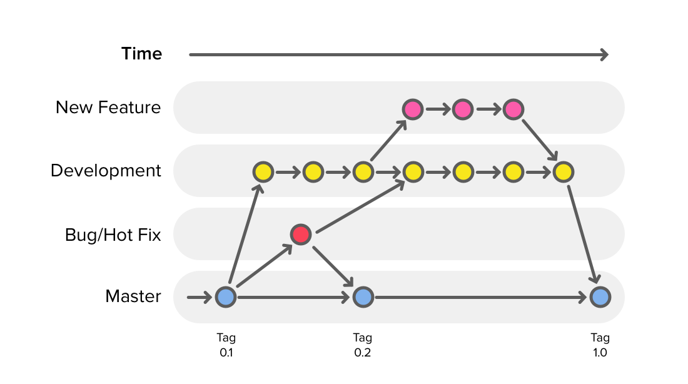
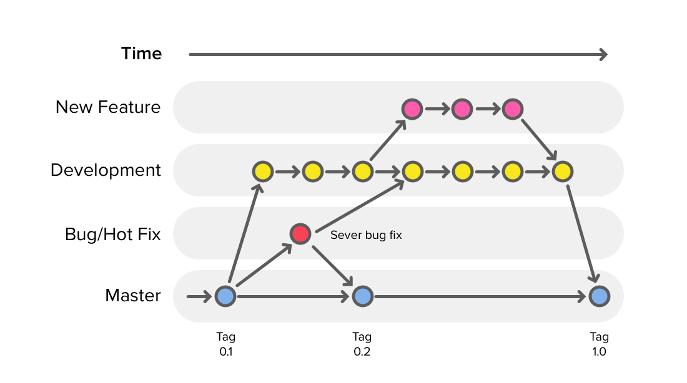
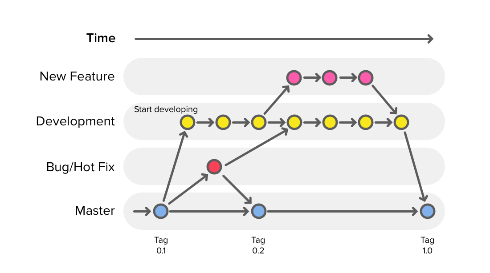
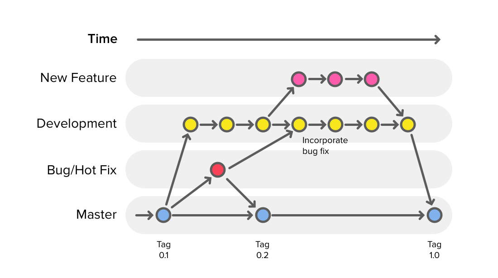
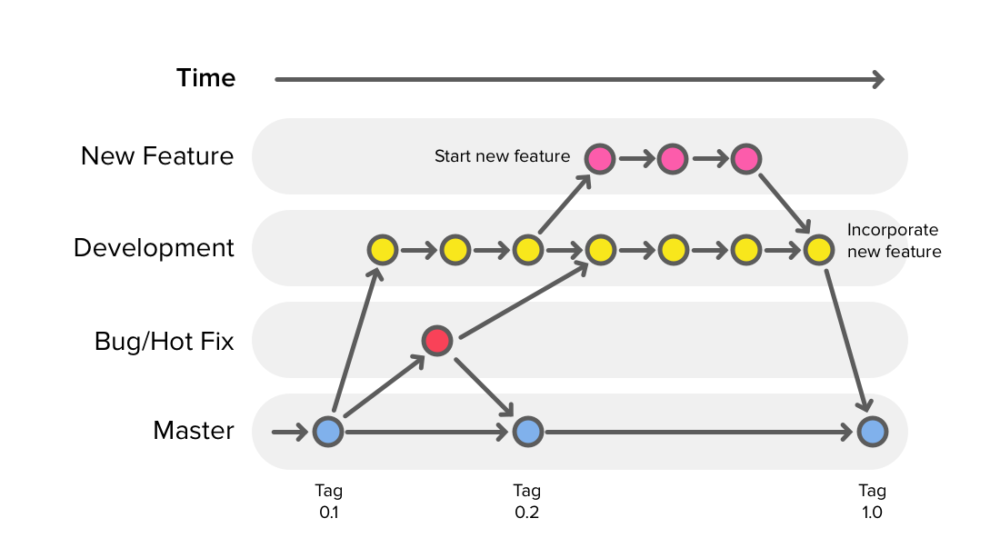
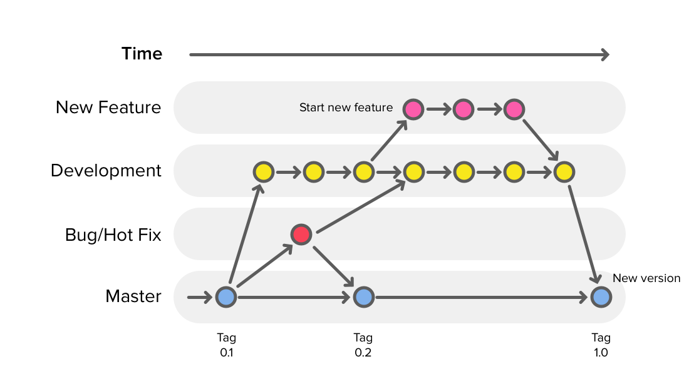

# Core-GitHub-3-Branching-and-Team-Workflows

Advanced GitHub for team work flows using branches to organize 
shared projects. 

The Lab for this class is located [here](https://github.com/Product-College-Labs/Core-GitHub-Braching/blob/master/README.md). 

The material presented here is based on the article: 
[A successful Git branching model](http://nvie.com/posts/a-successful-git-branching-model/). 

